# LLM Flux Gateway - 使用指南截图文档

本文档包含 LLM Flux Gateway 各功能页面的截图和使用说明。

## 快速导航

| 场景 | 说明 | 截图数量 |
|------|------|---------|
| [登录](./01-login/) | 用户认证入口 | 2 |
| [仪表盘](./02-dashboard/) | 数据分析概览 | 4 |
| [厂商管理](./03-vendors/) | LLM 供应商配置 | 3 |
| [资产管理](./04-assets/) | API Key 资产管理 | 5 |
| [路由管理](./05-routes/) | 请求路由配置 | 1 |
| [密钥管理](./06-keys/) | 访问密钥生成 | 1 |
| [Playground](./07-playground/) | 聊天测试界面 | 1 |
| [日志查询](./08-logs/) | 请求日志查看 | 1 |
| [系统设置](./09-system/) | 系统配置 | 1 |
| [完整工作流](./10-workflows/) | 端到端流程 | 7 |

---

## 首次使用指南

### 步骤 1: 同步厂商配置


进入 Vendors 页面，点击 "Sync from YAML" 按钮，系统会自动从配置文件同步所有支持的 LLM 厂商信息。

**操作步骤**:
1. 点击侧边栏 "Vendors"
2. 点击 "Sync from YAML" 按钮
3. 等待同步完成，查看同步结果

---

### 步骤 2: 创建资产

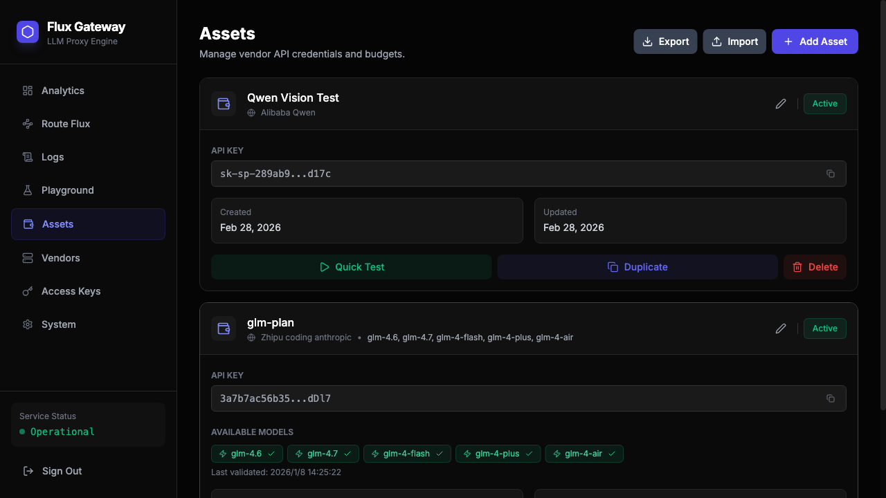

资产是您在各个 LLM 厂商的 API Key 配置。

**操作步骤**:
1. 点击侧边栏 "Assets"
2. 点击 "Add Asset" 按钮
3. 选择厂商
4. 输入资产名称和 API Key
5. 选择可用的模型
6. 点击 "Create" 完成创建

**创建向导截图**:

| 步骤 | 截图 |
|------|------|
| 步骤1: 选择厂商 | 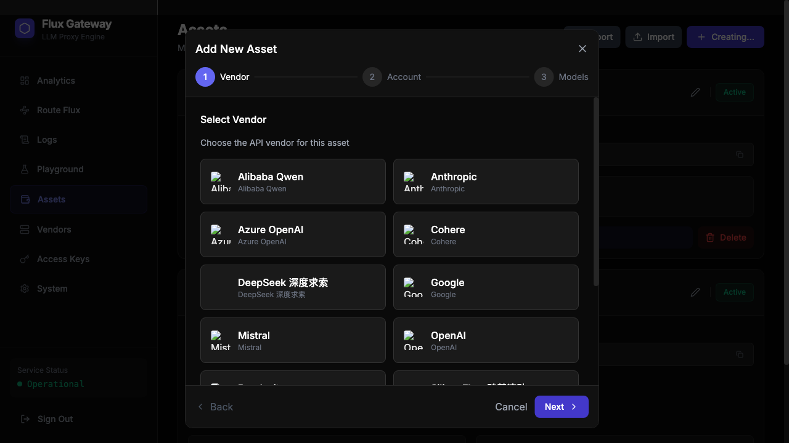 |
| 步骤2: 输入配置 | 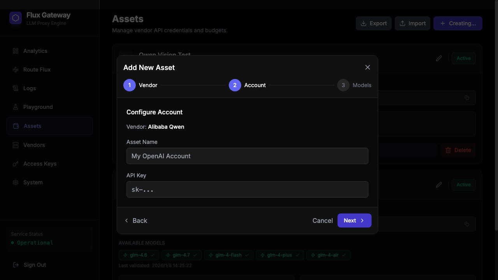 |
| 步骤3: 选择模型 | 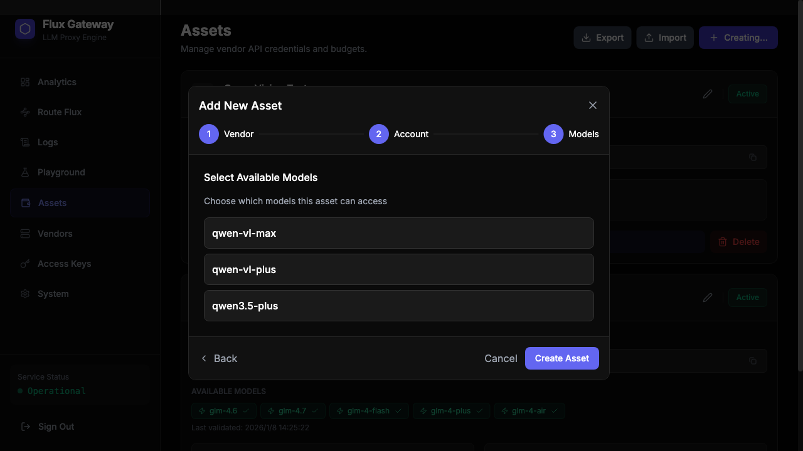 |

---

### 步骤 3: 创建路由


路由定义了请求如何被转发到上游 LLM 服务。

**操作步骤**:
1. 点击侧边栏 "Route Flux"
2. 输入路由名称
3. 选择关联的资产
4. 点击 "Add Route" 创建

---

### 步骤 4: 生成密钥


访问密钥用于调用 Gateway API。

**操作步骤**:
1. 点击侧边栏 "Access Keys"
2. 输入客户端名称
3. 选择关联的路由
4. 点击 "Generate API Key"
5. 复制生成的密钥（sk-flux-xxx）

---

### 步骤 5: 测试验证


使用 Playground 测试您的配置是否正确。

**操作步骤**:
1. 点击侧边栏 "Playground"
2. 选择 API Key 和 Model
3. 输入消息并发送
4. 查看响应结果

---

## 功能页面详解

### 1. 登录页面

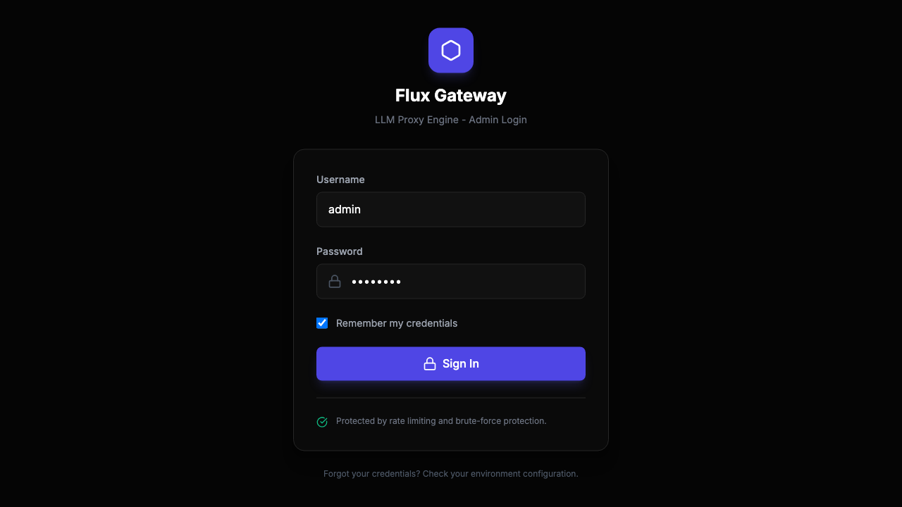

**功能说明**:
- 用户名/密码认证
- 记住凭据选项
- 登录失败保护（5次失败后锁定5分钟）

**默认凭据**:
- 用户名: `admin`
- 密码: `changeme`（可通过环境变量 `ADMIN_PASSWORD` 修改）

---

### 2. 数据分析仪表盘

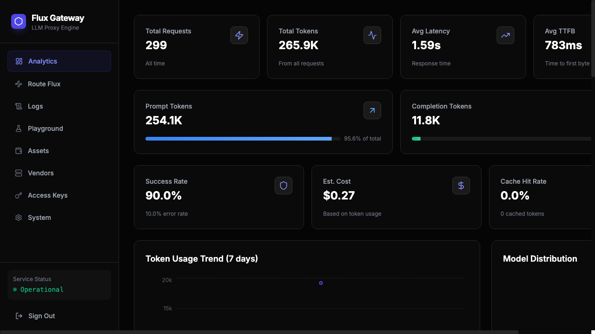

**功能说明**:
- **概览卡片**: Total Requests, Total Tokens, Avg Latency, Avg TTFB
- **Token 使用趋势**: 7天内的 Prompt/Completion Token 分布
- **模型分布**: 各模型的使用占比
- **TTFB 分布**: 首字节时间分布
- **最近请求**: 最近的请求记录表格

| 截图 | 说明 |
|------|------|
| 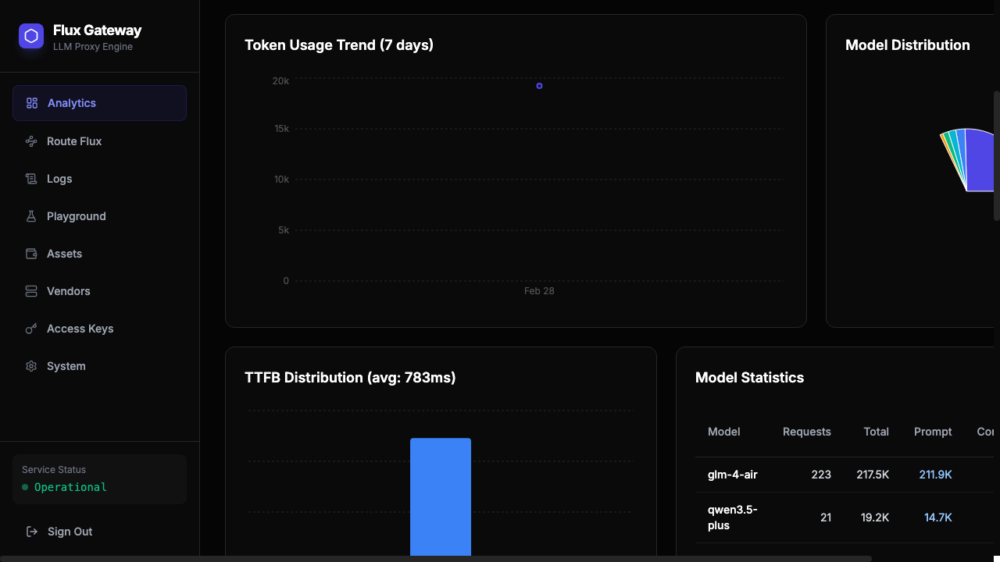 | Token 使用趋势 |
| 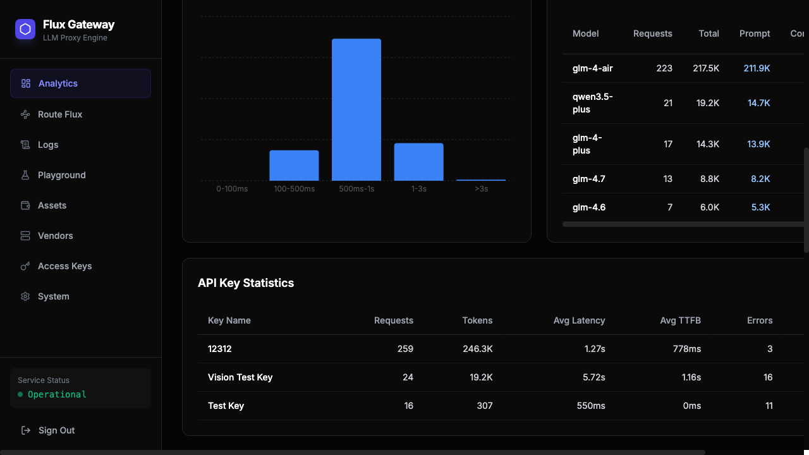 | 模型分布统计 |
| 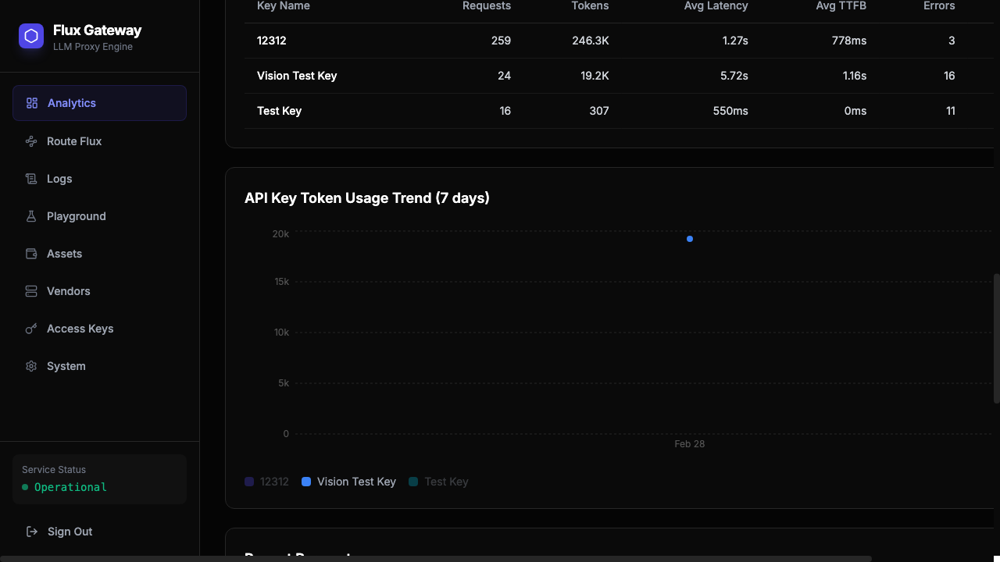 | 最近请求列表 |

---

### 3. 厂商管理

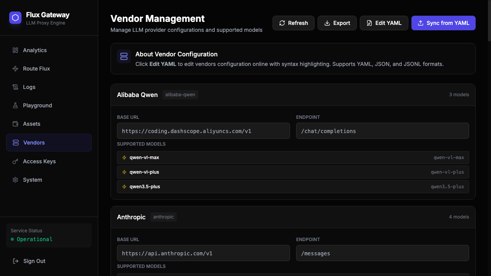

**功能说明**:
- 查看所有支持的 LLM 厂商
- 同步厂商配置（从 YAML）
- 编辑厂商 YAML 配置

| 截图 | 说明 |
|------|------|
| 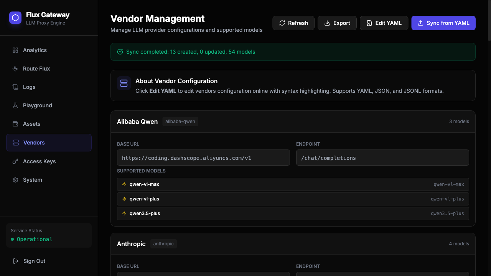 | 同步厂商配置 |
| 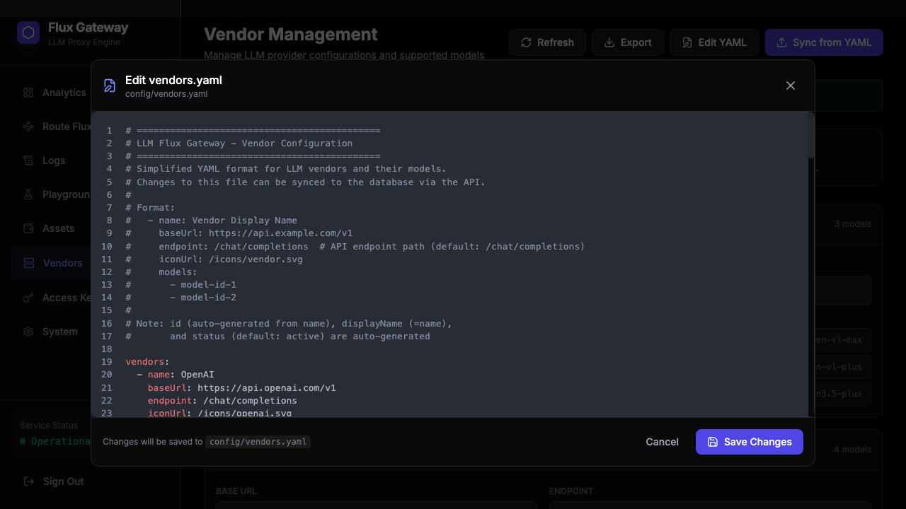 | 编辑 YAML 配置 |

---

### 4. 资产管理

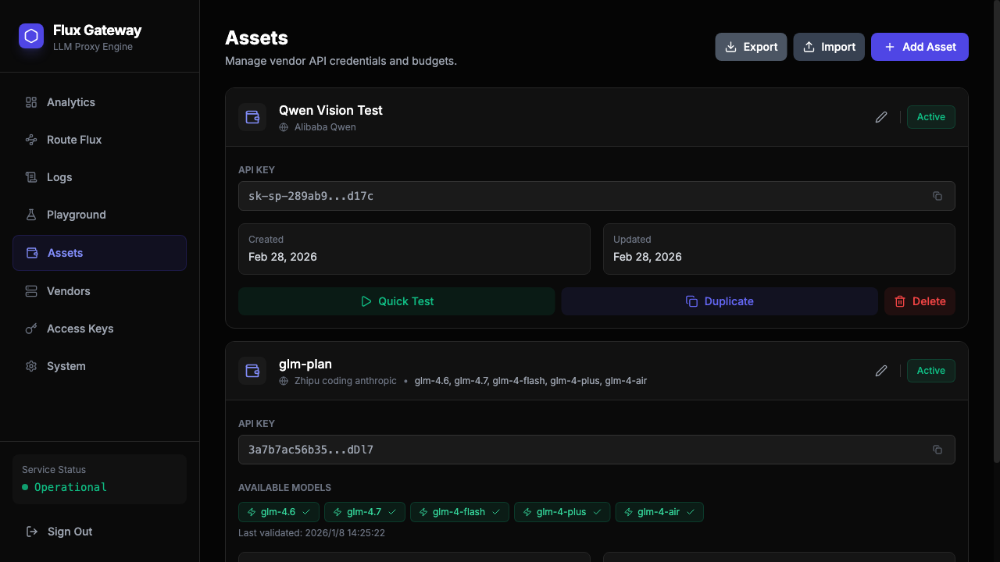

**功能说明**:
- 管理各厂商的 API Key
- 快速测试资产连通性
- 复制 API Key
- 启用/禁用资产

---

### 5. 路由管理

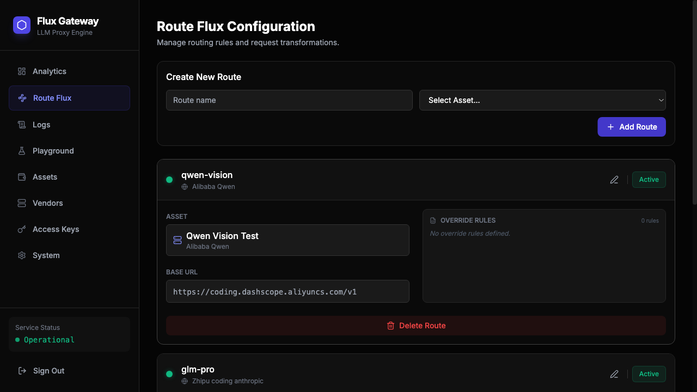

**功能说明**:
- 创建和管理路由
- 配置 Override 规则
- 关联资产

---

### 6. 密钥管理

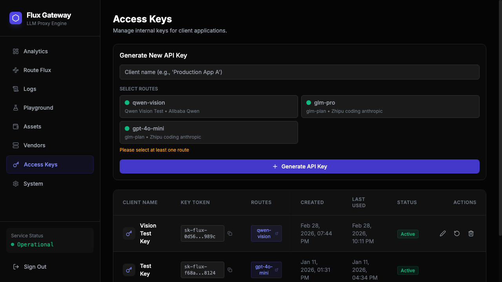

**功能说明**:
- 生成访问密钥
- 管理密钥关联的路由
- 启用/禁用密钥

---

### 7. Playground


**功能说明**:
- 多轮对话测试
- 模型选择
- 流式响应
- 工具调用支持
- Debug 面板

---

### 8. 日志查询

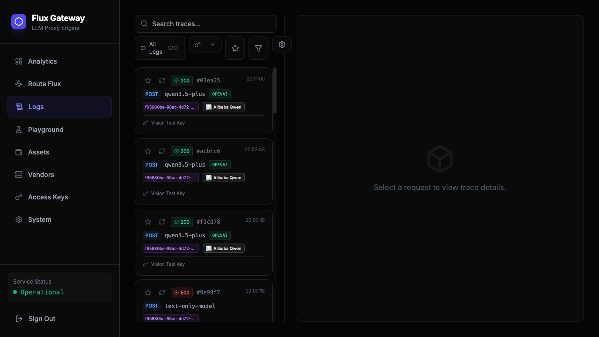

**功能说明**:
- 查看请求日志
- 过滤和搜索
- 查看请求详情
- 重试请求

---

### 9. 系统设置

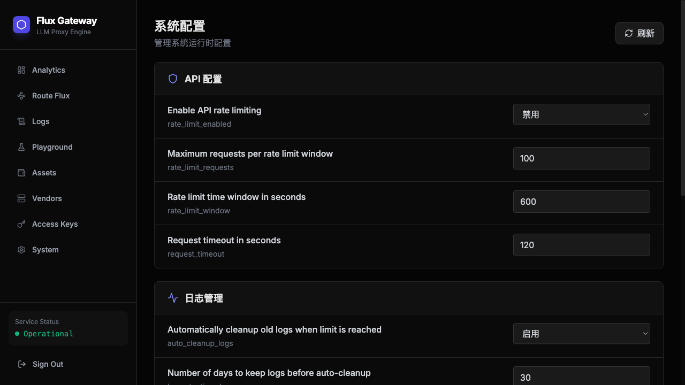

**功能说明**:
- 系统配置管理
- 运行状态查看

---

## 日常使用流程

### 查看分析数据


定期查看 Dashboard 了解系统使用情况。

### 测试新模型

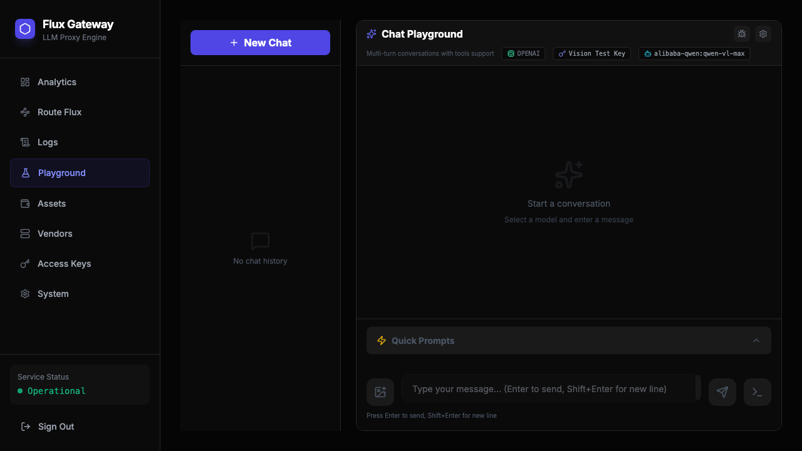

使用 Playground 测试不同模型的效果。

---

## 使用 curl 调用 Gateway

生成密钥后，可以使用以下方式调用 Gateway：

```bash
curl https://your-gateway.com/v1/chat/completions \
  -H "Authorization: Bearer sk-flux-xxx" \
  -H "Content-Type: application/json" \
  -d '{
    "model": "gpt-4o",
    "messages": [{"role": "user", "content": "Hello!"}]
  }'
```

---

## 相关文档

- [快速开始指南](../guides/quick-start.md)
- [使用场景说明](../guides/usage-scenarios.md)
- [项目需求文档](../development/project-requirements.md)
